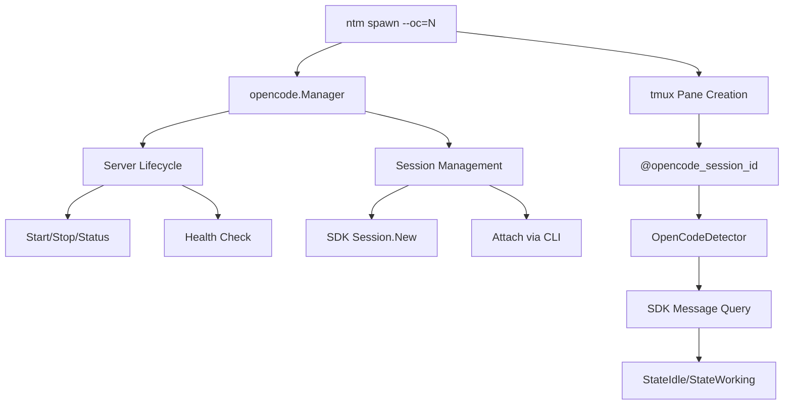

# OpenCode Manager Design Analysis

## Current Structure (524 lines)

The `Manager` struct is a comprehensive component handling multiple concerns:

```
Manager (internal/opencode/manager.go)
├── Server Lifecycle (Start, Stop, Status, List, Reap, URL)
├── Session Management (CreateSession, ProvisionSessions)
├── SDK Integration (Client, SendPrompt)
└── Infrastructure Helpers (isServerHealthy, countConnections, isProcessRunning)
```

## API Surface Analysis

| Method | Concern | Lines | Dependencies |
|--------|---------|-------|--------------|
| `NewManager()` | Construction | 15 | filesystem |
| `ProjectID()` | Utility | 11 | crypto/md5 |
| `ProjectStateDir()` | Utility | 3 | - |
| `PortForProject()` | Utility | 14 | crypto/md5 |
| `Start()` | Server Lifecycle | 90 | exec, filesystem |
| `Stop()` | Server Lifecycle | 50 | syscall |
| `Status()` | Server Lifecycle | 55 | filesystem |
| `List()` | Server Lifecycle | 38 | filesystem |
| `Reap()` | Server Lifecycle | 25 | - |
| `URL()` | Server Lifecycle | 12 | - |
| `Client()` | SDK | 8 | opencode-sdk-go |
| `CreateSession()` | Session | 18 | SDK |
| `ProvisionSessions()` | Session | 30 | SDK |
| `SendPrompt()` | Session | 15 | SDK |
| `isServerHealthy()` | Infra | 8 | net |
| `countConnections()` | Infra | 30 | exec (ss/lsof) |
| `isProcessRunning()` | Infra | 10 | syscall |

## Design Issues

### Issue 1: Mixed Responsibilities (SRP Violation)

The Manager handles three distinct concerns:
1. **Server Lifecycle** - spawning, killing, health checks
2. **Session Management** - SDK-based session creation and prompts
3. **State Persistence** - reading/writing PID files, port files, etc.

**Impact:** Changes to session logic require understanding server lifecycle code.

### Issue 2: Implicit Dependencies

```go
// Client() implicitly requires Status() and URL()
func (m *Manager) Client(projectPath string) (*opencode.Client, error) {
    url, err := m.URL(projectPath)  // calls Status() internally
    ...
}
```

Callers must understand the call chain to reason about failures.

### Issue 3: No Interface Abstraction

The Manager is a concrete struct with no interface, making:
- Testing harder (can't mock)
- Alternative implementations impossible

### Issue 4: Context Inconsistency

Some methods accept `context.Context`, others don't:

| With Context | Without Context |
|--------------|-----------------|
| `ProvisionSessions()` | `Start()` |
| `SendPrompt()` | `Stop()` |
| `CreateSession()` | `Status()` |

---

## Proposed Design: Split by Concern

### Option A: Sub-packages

```
internal/opencode/
├── manager.go          # Facade combining all
├── server/
│   ├── server.go       # Start, Stop, Status, List, Reap
│   └── health.go       # isServerHealthy, countConnections
├── session/
│   ├── session.go      # CreateSession, ProvisionSessions, SendPrompt
│   └── client.go       # SDK client factory
└── state/
    └── state.go        # PID file, port file, state directory
```

**Pros:** Clear separation, each package testable independently
**Cons:** More files, import dance between packages

### Option B: Interface + Composition

```go
// manager.go
type Manager interface {
    ServerManager
    SessionManager
}

type ServerManager interface {
    Start(projectPath string) (*ServerInfo, error)
    Stop(projectPath string, force bool) error
    Status(projectPath string) (*ServerInfo, error)
    List() ([]*ServerInfo, error)
}

type SessionManager interface {
    Client(projectPath string) (*opencode.Client, error)
    ProvisionSessions(ctx context.Context, projectPath, name string, count int) (*ServerInfo, []string, error)
    SendPrompt(ctx context.Context, projectPath, sessionID, prompt string) error
}
```

**Pros:** Mockable, composable, clear contracts
**Cons:** Might be over-engineering for current use

### Option C: Keep Single File, Extract Functions

```go
// manager.go - keep as facade
// health.go - extracted health check logic
// state.go - extracted state persistence
```

**Pros:** Minimal refactoring, easier review
**Cons:** Still mixed concerns in manager.go

---

## Recommended Approach: Option C (Incremental)

Keep the current structure but extract helper logic:

### Phase 1: Extract health.go (Low Risk)

```go
// health.go
package opencode

func IsServerHealthy(port int, timeout time.Duration) bool { ... }
func CountConnections(port int) int { ... }
func IsProcessRunning(pid int) bool { ... }
```

### Phase 2: Extract state.go (Low Risk)

```go
// state.go
package opencode

type StateStore struct {
    baseDir string
}

func (s *StateStore) SavePID(projectID string, pid int) error
func (s *StateStore) LoadPID(projectID string) (int, error)
func (s *StateStore) SavePort(projectID string, port int) error
func (s *StateStore) Clean(projectID string) error
```

### Phase 3: Add Context to All Methods (Breaking)

```go
// Before
func (m *Manager) Start(projectPath string) (*ServerInfo, error)

// After
func (m *Manager) Start(ctx context.Context, projectPath string) (*ServerInfo, error)
```

### Phase 4: Define Interface (Optional)

Only if needed for testing or alternative implementations.

---

## Quick Wins (No Breaking Changes)

### 1. Fix Mermaid Diagram



### 2. Document Public API

Add comprehensive godoc comments:

```go
// Manager handles lifecycle of per-project OpenCode servers.
//
// The Manager provides three main capabilities:
//   - Server lifecycle: Start, Stop, Status, List, Reap
//   - Session management: CreateSession, ProvisionSessions, SendPrompt  
//   - SDK integration: Client
//
// Thread Safety: Methods are not thread-safe. Callers should serialize
// calls when managing the same project from multiple goroutines.
type Manager struct {
    stateDir string
}
```

### 3. Add Method Groups

Use blank lines to visually group related methods in the source.

---

## Test Coverage Gaps

| Method | Unit Test | Integration Test |
|--------|-----------|------------------|
| `ProjectID()` | ✅ | - |
| `PortForProject()` | ✅ | - |
| `Status()` (not running) | ✅ | - |
| `List()` (empty) | ✅ | - |
| `Start()` | ❌ | ✅ E2E |
| `Stop()` | ❌ | ✅ E2E |
| `ProvisionSessions()` | ❌ | ✅ E2E |
| `SendPrompt()` | ❌ | ✅ E2E |

**Recommendation:** Add unit tests for `Start()` and `Stop()` with mock server.

---

## Summary

| Priority | Change | Effort | Risk |
|----------|--------|--------|------|
| 1 | Fix Mermaid diagram | Low | None |
| 2 | Add godoc comments | Low | None |
| 3 | Add Context to all methods | Medium | Breaking |
| 4 | Extract health.go | Medium | Low |
| 5 | Extract state.go | Medium | Low |
| 6 | Define interfaces | High | Low |
| 7 | Sub-packages | High | Medium |

Current design is **acceptable** for the project's complexity level. The main improvements would be:
1. Better documentation
2. Consistent Context usage
3. Extract infrastructure helpers for testability
